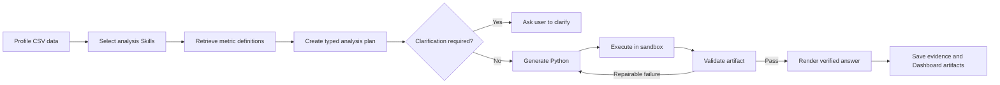

# DataSays

DataSays is an evidence-first data analysis Agent for people who need reproducible answers from CSV data without writing Python. It profiles uploaded datasets, grounds business metrics in local definitions, creates a typed analysis plan, executes generated Python in a constrained sandbox, validates the artifact, and exposes the evidence trail in a bilingual Web workspace.

The current repository is a portfolio-ready local MVP. It demonstrates a bounded Agent workflow; it is not yet a production multi-tenant SaaS.

## Product

DataSays is designed around a simple promise: a business answer should say how it was calculated, which fields and metric definitions it used, and whether the executable result passed validation.

### Product surfaces

- **Verified Analysis:** upload one or more CSV files and receive one sandbox-backed answer with its plan, code, checks, assumptions, repair history, and execution trace.
- **Comparison Lab:** compare three models across three prompt strategies for development and evaluation. This is not the primary customer workflow.
- **Data Dashboard:** open chart-ready structured results as interactive tables and charts without asking sandbox code to render images.

The UI supports Simplified Chinese and English, light and dark themes, responsive side panels, persistent conversations, and reusable dashboard artifacts.

## Agent Workflow



The current workflow is implemented as a typed, bounded service orchestration. LangGraph checkpoints, real-time event streaming, resumable human approval, structured conversation memory, and MCP access are planned upgrades rather than current claims.

## What Is Implemented

- Dataset profiling: types, missingness, semantic roles, cardinality, ranges, samples, and duplicate rate.
- Four local analysis playbooks for quality checks, aggregation/ranking, time/cohort analysis, and metric diagnostics.
- Versioned ecommerce and SaaS metric definitions with deterministic alias matching and schema binding.
- Pydantic contracts for analysis plans, results, validation reports, and visualization specifications.
- OpenRouter model access with Qwen3.6 Flash, GPT-5.4 Mini, and Kimi K2.5 controls.
- Generated Python execution with timeout, CPU/memory limits, no network, non-root user, and read-only data mount when Docker mode is enabled.
- Deterministic validation and a bounded code repair loop.
- Interactive bar, line, pie, scatter, histogram, box, heatmap, and table views.
- SQLite persistence for conversations, messages, analysis runs, file associations, code, evidence, trace, and Dashboard payloads.
- A 24-case local evaluation harness plus deterministic backend tests.

## Architecture

```text
datasays/
├── App.tsx                         # React application shell and persisted chat state
├── components/                     # Analysis, comparison, evidence, and Dashboard UI
│   └── ui/                         # Only the shadcn/Radix primitives in active use
├── lib/                            # API client, shared types, i18n, and formatting
├── styles/                         # Global Tailwind styles
├── server/
│   ├── main.py                     # FastAPI entry point
│   ├── app/
│   │   ├── routes/                 # Files, queries, and conversations
│   │   ├── schemas/                # Typed Agent and visualization contracts
│   │   ├── services/               # Planning, tools, sandbox, validation, persistence
│   │   └── knowledge/              # Analysis playbooks and metric packs
│   ├── evals/                      # 24-case executable benchmark harness
│   ├── tests/                      # Deterministic service tests
│   ├── Dockerfile                  # FastAPI runtime
│   └── Dockerfile.python-sandbox   # Isolated analysis runtime
├── docs/                           # Product, persistence, and visualization contracts
├── docker-compose.yml              # Local self-hosted stack
└── Dockerfile.frontend             # React build served through Nginx
```

## Local Development

### Prerequisites

- Node.js 18+
- Python 3.11+
- Docker Desktop for the recommended sandbox mode
- An [OpenRouter](https://openrouter.ai/) API key

### 1. Configure the backend

```bash
cp server/env.example server/.env
```

Set `OPENROUTER_API_KEY` in `server/.env`. Build the sandbox once:

```bash
docker build -t datasays-python-sandbox -f server/Dockerfile.python-sandbox server
```

### 2. Start the application

```bash
# Terminal 1
./start-backend.sh

# Terminal 2
./start-frontend.sh
```

Open `http://127.0.0.1:5173`. The API and OpenAPI documentation run at `http://127.0.0.1:8000` and `http://127.0.0.1:8000/docs`.

For development without Docker, set `USE_DOCKER=false` in `server/.env`. This executes generated code directly on the host and must not be used for a public deployment.

## Docker Self-Hosting

Docker Compose packages the frontend, FastAPI backend, sandbox image, persistent uploads, and SQLite data volumes. Docker Desktop is still required because the Agent executes generated Python in isolated containers.

```bash
export OPENROUTER_API_KEY="your-key"
docker compose up --build
```

Open `http://localhost:8080`. Stop the stack with `docker compose down`. Named volumes preserve uploaded files and conversation history across container replacement.

## Verification

```bash
npm ci
npm run build

cd server
python -m unittest discover -s tests -v
```

To run the LLM-backed evaluation harness, start the API and then run `python evals/run_eval.py` from `server/`. The included cases are a small locally authored benchmark inspired by tabular QA and executable data-science evaluations; they are not an official DABench import.

## Persistence And Privacy

- SQLite defaults to `server/data/datasays.db`.
- Uploaded CSVs and metadata default to `server/uploads/`.
- Browser refresh restores completed messages, evidence, code, traces, file links, and Dashboard artifacts.
- The next question does **not** yet receive prior messages as model context. Current persistence is an audit history, not full Agent memory.
- Dataset profiles, samples, generated artifacts, or result summaries may be sent to the selected OpenRouter model. Local hosting does not currently mean fully offline processing.
- `.env`, uploads, databases, virtual environments, dependencies, and local Agent design Skills are excluded from Git.

See [persistence and memory](docs/PERSISTENCE_AND_MEMORY.md) and the [visualization contract](docs/VISUALIZATION_CONTRACT.md) for details.

## Current Boundaries

- CSV input only; Excel, SQL, PDF, and image extraction are later work.
- Local metric retrieval is deterministic keyword/schema matching, not vector RAG.
- Progress shown during a request is not yet a live backend event stream.
- Validation proves execution and contract consistency; it does not independently prove every generated calculation is semantically correct.
- SQLite and local files are suitable for a local MVP, not multi-user SaaS.
- Public deployment still requires authentication, tenant isolation, object storage, a database service, job queues, quotas, monitoring, and a hardened remote execution worker.

The current scope and roadmap are described in [DataSays 2.0](docs/DATASAYS_2_0.md).

## License

This repository originated as an ISE547 course project. No standalone open-source license has been granted yet.
