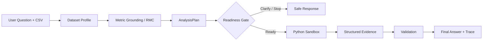

# DataSays

[English](README.md) | [简体中文](README.zh-CN.md)

**Evidence-first Data Analysis Agent for tabular and business data.**

DataSays turns natural-language questions and CSV files into structured analysis plans, sandbox-executed Python, and machine-readable evidence. Instead of treating runnable code as proof of correctness, it makes metric definitions, analysis populations, denominators, joins, assumptions, and validation results visible and traceable.

DataSays is a local portfolio prototype for verifiable analytics workflows. It is not a production ML platform, an autonomous data scientist, or a fully general analytics system.

| Current capability baseline | Result |
|---|---:|
| Capability coverage | 13 cases / 4 tracks |
| Successful executions | 12 / 13 |
| Audited numerical reference matches | 12 / 12 executed cases |
| Strict Plan -> Evidence -> Reference E2E | 7 / 13 |

The numerical audit and strict E2E score are reported together intentionally: correct calculations do not by themselves prove that the full product contract is complete.

## Why Evidence-first Analytics

Two Python programs can both execute successfully while answering different business questions. For example, one AOV calculation may include every paid order while another includes only completed orders. If the numerator and denominator use different populations, the code can run without error and still produce a misleading answer.

```text
Executable code != correct metric semantics != trustworthy answer
```

DataSays therefore treats the analysis plan, metric definition, population, denominator, grain, joins, assumptions, executable result, and supporting evidence as one connected contract.

## How It Works



The Resolved Metric Contract (RMC) combines reusable metric knowledge, project-level overrides, and bindings to real dataset fields into one effective contract for planning. A fail-closed readiness gate prevents incomplete plans from reaching code generation. Generated Python runs in a constrained sandbox, and the result links planned metrics to machine-readable evidence.

The workflow is implemented with LangGraph, FastAPI, and Pydantic contracts, but the product boundary is the evidence-first workflow rather than any individual framework.

## Analysis Capabilities

| Capability | Status | Current evidence |
|---|---|---|
| Filtering and conditional metrics | **Supported** | Strict E2E capability case |
| Grouped comparison | **Supported** | Strict E2E capability case |
| Ranking / Top-N | **Supported** | Strict E2E capability case |
| Distribution / quantiles | **Supported** | Strict E2E capability case |
| Descriptive statistics | **Partially Supported** | Correct calculations; one output-typing gap |
| Confidence intervals, Welch tests, effect size, correlation | **Experimental / Computationally Demonstrated** | Correct computations; incomplete Evidence coverage |
| Logistic Regression, Random Forest, Linear Regression | **Experimental / Computationally Demonstrated** | Fixed-data probes with deterministic split and reference |
| Cohort / retention | **Partially Supported** | Reference values reproduced; event semantics remain limited |
| Funnel analysis | **Not Yet Demonstrated** | Current plan is stopped by the readiness contract before execution |

Experimental means that a fixed probe executed and matched its independent reference. It does not mean that DataSays provides a production-ready statistical or predictive modeling workflow.

## Reliability Features

- **Metric grounding:** resolves business metric identity, formulas, field bindings, and project-level policies before code generation.
- **Population and denominator:** keeps shared base populations separate from metric-specific numerator, denominator, and filter rules.
- **Grain and joins:** records entity grain, join relationships, and required pre-aggregation to reduce duplication and join inflation.
- **Plan normalization:** deterministically repairs serialization differences without inventing business meaning.
- **Fail-closed Gate:** replans, asks for clarification, or stops safely when the analytical contract is incomplete.
- **Structured Evidence:** maps each planned metric to scalar or dataset evidence that can be checked independently of prose.

## Evaluation

DataSays uses two separate benchmarks. They measure different qualities and are never combined into one overall accuracy score.

### Analysis Capability Benchmark V1

This 13-case suite measures breadth across Core, Statistical, Predictive, and Behavioral analysis. Expected values are generated independently with deterministic Python references, fixed data, and fixed seeds.

| System quality metric | Result |
|---|---:|
| Canonical AnalysisPlan | 13 / 13 |
| Gate Ready | 12 / 13 |
| Successful execution | 12 / 13 |
| Valid AnalysisResult | 12 / 13 |
| Strict machine-readable reference | 9 / 13 |
| Evidence complete | 8 / 13 |
| Audited strict E2E | 7 / 13 |

All 12 executed cases matched their audited core numerical references. The lower strict scores expose product gaps in result representation, Evidence coverage, and behavioral semantics rather than hiding them behind execution success.

See the [case definitions](server/evals/capability_probe_cases.json), [deterministic references](server/evals/capability_probe_references.json), and [capability runner](server/evals/run_capability_probes.py).

### Business Analytics Reliability Benchmark

Olist-24 is a strict reliability stress test for metric semantics, population, numerator and denominator policy, entity grain, multi-table joins, pre-aggregation, business-event time, clarification, and structured evidence.

The current post-RMC strict baseline is **3 / 24**. This is deliberately not presented as DataSays' overall analysis accuracy: the suite retains difficult failures to diagnose reliability layers, benchmark assumptions, and representation gaps. It is not mixed with the Analysis Capability Benchmark score.

See the [evaluation guide](server/evals/README.md), [benchmark design](server/evals/BENCHMARK_DESIGN.md), and [evaluation-driven reliability retrospective](docs/evaluation-driven-reliability-improvement.md).

## Example Workflow

**Question**

> Analyze 2017 delivered orders, Payment GMV, AOV, Delivery Rate, and their monthly trends.

**Resolved plan**

- Use the purchase event as the reporting time.
- Aggregate payment rows to `order_id` before joining.
- Calculate Payment GMV and AOV on delivered orders.
- Preserve all eligible orders as the Delivery Rate denominator.
- Keep orders as the denominator-preserving left-side population.

**Evidence-backed result**

| Planned fact | Result |
|---|---:|
| Delivered Orders | 14,429 |
| Payment GMV | 2,320,454.39 |
| AOV | 160.82 |
| Delivery Rate | 96.19% |
| Monthly trend | Structured dataset |

The important output is not only the four values; it is the traceable path from question to metric contract, plan, Python computation, evidence, and validation.

## Current Limitations

- Statistical Evidence is not yet fully structured even when the underlying calculation is correct.
- Funnel analysis does not yet have a stable executable contract.
- Cohort and retention event semantics remain limited.
- Predictive tasks are experimental probes, not production ML support.
- The primary input is CSV; Excel, SQL, PDF, and image extraction are not current product capabilities.
- Validation checks execution and explicit contracts but cannot independently prove every business interpretation is semantically correct.
- DataSays is a local single-user prototype, not a production multi-tenant service.

## Evaluation-driven Development

```text
Benchmark
-> identify the first failure layer
-> make the smallest deterministic change
-> add regression tests
-> rerun only affected cases
-> freeze a new baseline
```

This process separates retrieval, planning, readiness, code execution, result contracts, evidence, semantic correctness, and scorer behavior. Failed stress-test cases are retained instead of weakening expected answers to improve headline scores.

## Running Locally

### Prerequisites

- Node.js 18+
- Python 3.11+
- Docker Desktop for the recommended sandbox mode
- An [OpenRouter](https://openrouter.ai/) API key

### Configure and start

```bash
cp server/env.example server/.env
```

Set `OPENROUTER_API_KEY` in `server/.env`, then build the sandbox image once:

```bash
docker build -t datasays-python-sandbox -f server/Dockerfile.python-sandbox server
```

Start the backend and frontend in separate terminals:

```bash
./start-backend.sh
./start-frontend.sh
```

Open `http://127.0.0.1:5173`. The API documentation is available at `http://127.0.0.1:8000/docs`.

For local development without Docker, set `USE_DOCKER=false` in `server/.env`. This executes generated Python on the host and must not be used for a public deployment.

### Docker Compose

```bash
export OPENROUTER_API_KEY="your-key"
docker compose up --build
```

Open `http://localhost:8080`. Named volumes preserve uploaded files and conversation data.

### Development checks and evaluation

```bash
npm ci
npm run build

cd server
python -m unittest discover -s tests -v
python evals/run_capability_probes.py
```

The evaluation runner calls the configured model and can incur latency and API cost. Evaluation result artifacts are local and excluded from Git.

## Data, Persistence, and Privacy

- Conversations and analysis runs are stored in local SQLite by default.
- LangGraph checkpoints use a separate local SQLite database.
- Uploaded CSV files and metadata remain in the local uploads directory.
- Browser refresh restores persisted messages, evidence, code, traces, file links, and Dashboard artifacts.
- Dataset profiles, samples, prompts, or generated artifacts may be sent to the selected OpenRouter model; local hosting is not fully offline processing.
- Environment files, uploads, databases, checkpoints, and evaluation artifacts are excluded from Git.

See [persistence and memory](docs/PERSISTENCE_AND_MEMORY.md) and the [visualization contract](docs/VISUALIZATION_CONTRACT.md).

## Roadmap

1. Complete machine-readable Evidence for statistical analysis.
2. Stabilize one behavioral workflow: Funnel or Cohort.
3. Broaden capability evaluation without weakening deterministic references or reliability requirements.

## Repository Structure

```text
datasays/
├── App.tsx                     # React analysis workspace
├── components/                 # Analysis, evidence, comparison, and Dashboard UI
├── lib/                        # API client, shared types, i18n, and formatting
├── server/
│   ├── main.py                 # FastAPI entry point
│   ├── app/                    # Agent routes, contracts, and services
│   ├── app/knowledge/          # Skills, metric definitions, and project overrides
│   ├── evals/                  # Capability and reliability benchmarks
│   └── tests/                  # Deterministic regression tests
├── docs/                       # Product contracts and technical retrospectives
└── docker-compose.yml          # Local self-hosted stack
```

## License

This repository originated as an ISE547 course project. No standalone open-source software license has been granted yet. Olist benchmark data has separate attribution and licensing information in the [evaluation data documentation](server/evals/data/olist/README.md).
