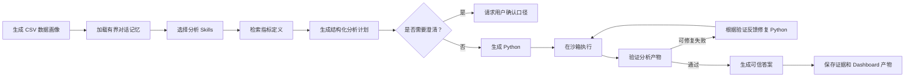

# DataSays

[English](README.md) | [简体中文](README.zh-CN.md)

DataSays 是一个证据优先的数据分析 Agent，面向需要从 CSV 获取可复现答案、但不编写 Python 的用户。系统会生成数据画像、将业务指标绑定到本地定义、制定结构化分析计划、在受限环境执行生成的 Python、验证分析产物，并在双语 Web 工作区展示完整证据链。

当前仓库是可用于作品集展示的本地 MVP，体现单一有界 Agent 工作流；它尚未达到生产级多租户 SaaS 的成熟度。

## 产品形态

DataSays 的核心承诺是：业务答案应说明如何计算、使用了哪些字段和指标定义，以及可执行结果是否通过验证。

### 三个产品界面

- **可信分析（Verified Analysis）：** 上传一个或多个 CSV，获得由 Python 计算支撑的单一答案，并查看计划、代码、检查项、假设、修复历史和执行轨迹。
- **对比实验室（Comparison Lab）：** 比较三个模型和三种 Prompt 策略，用于开发与评测，不是普通用户的主要流程。
- **数据看板（Data Dashboard）：** 将结构化分析产物展示为可交互表格和图表，不要求沙箱生成图片。

界面支持简体中文和英文、亮色和深色主题、响应式侧栏、对话持久化和可复用 Dashboard 产物。

## Agent 工作流



该流程使用类型化 LangGraph `StateGraph` 实现。条件边控制澄清、验证、有界修复和结束路径。每次运行拥有独立 Graph Thread ID，节点状态保存到本地 SQLite checkpoint，`POST /api/query/stream` 通过 SSE 将真实节点开始与完成事件推送到前端。当前尚未开放 checkpoint 原地恢复、人工审批或 time-travel API。

## 已实现能力

- 数据画像：字段类型、缺失率、语义角色、基数、范围、样例和重复率；
- 数据质量、聚合排名、时间/Cohort、指标诊断四类本地分析 Playbook；
- 版本化电商与 SaaS 指标定义，以及确定性别名匹配和字段绑定；
- 分析计划、结果、验证报告和可视化规格的 Pydantic 契约；
- 通过 OpenRouter 使用 Qwen3.6 Flash、GPT-5.4 Mini 和 Kimi K2.5；
- Docker 模式下具有超时、CPU/内存限制、禁网、非 root 用户和只读数据挂载的 Python 执行；
- 确定性验证和有界代码修复循环；
- LangGraph 规划、执行、验证、修复和结果生成节点；
- SQLite Graph checkpoint 和 SSE 实时执行进度；
- 柱状图、折线图、饼图、散点图、直方图、箱线图、热力图和表格；
- 对话、消息、分析运行、文件关联、代码、证据、Trace 和 Dashboard 的 SQLite 持久化；
- 基于近期消息和同数据集已验证结论的有界记忆，失败运行不进入可信结论；
- 两套互补的 24 题 Olist 评测：v1 确定性计算回归，以及包含澄清和多轮记忆的 v2 经营分析能力评测；

## 项目结构

```text
datasays/
├── App.tsx                         # React 应用外壳与对话状态
├── components/                     # 分析、对比、证据和 Dashboard UI
│   └── ui/                         # 当前实际使用的 shadcn/Radix 基础组件
├── lib/                            # API Client、类型、i18n 和格式化
├── styles/                         # Tailwind 全局样式
├── server/
│   ├── main.py                     # FastAPI 入口
│   ├── app/
│   │   ├── routes/                 # 文件、查询和对话 API
│   │   ├── schemas/                # Agent 与可视化类型契约
│   │   ├── services/               # 规划、工具、沙箱、验证和持久化
│   │   └── knowledge/              # 分析 Playbook 与指标定义
│   ├── evals/                      # 24 题 Olist 经营分析 Benchmark
│   ├── tests/                      # 确定性服务测试
│   ├── Dockerfile                  # FastAPI 运行环境
│   └── Dockerfile.python-sandbox   # 隔离 Python 分析环境
├── docs/                           # 产品、记忆和可视化协议
├── docker-compose.yml              # 本地自托管编排
└── Dockerfile.frontend             # React 构建与 Nginx 服务
```

## 本地开发

### 前置条件

- Node.js 18+
- Python 3.11+
- 推荐使用 Docker Desktop 运行沙箱
- [OpenRouter](https://openrouter.ai/) API Key

### 1. 配置后端

```bash
cp server/env.example server/.env
```

在 `server/.env` 中设置 `OPENROUTER_API_KEY`。首次使用 Docker 沙箱时构建镜像：

```bash
docker build -t datasays-python-sandbox -f server/Dockerfile.python-sandbox server
```

### 2. 启动应用

```bash
# 终端 1
./start-backend.sh

# 终端 2
./start-frontend.sh
```

浏览器打开 `http://127.0.0.1:5173`。API 与 OpenAPI 文档分别位于 `http://127.0.0.1:8000` 和 `http://127.0.0.1:8000/docs`。

开发时可以在 `server/.env` 设置 `USE_DOCKER=false`，但这会在宿主机直接执行生成代码，不能用于公开部署。

## Docker 自托管

Docker Compose 会打包前端、FastAPI 后端、沙箱镜像、上传目录和 SQLite 数据卷。由于 Agent 需要执行生成的 Python，仍需安装并启动 Docker Desktop。

```bash
export OPENROUTER_API_KEY="your-key"
docker compose up --build
```

打开 `http://localhost:8080`。使用 `docker compose down` 停止；命名卷会在容器替换后保留上传文件与对话历史。

## 验证与评测

```bash
npm ci
npm run build

cd server
python -m unittest discover -s tests -v
```

评测目录基于同一套 Olist 精简数据提供两条轨道：运行 `python evals/run_eval.py` 执行 v1 确定性计算回归；运行 `python evals/run_business_eval.py` 执行 v2 经营分析能力评测，覆盖指标执行、粒度安全、经营诊断、决策支持、澄清和多轮记忆。两套题均由 DataSays 本地设计，不是 Olist 或 DataSciBench 官方题集。详见 [`server/evals/README.md`](server/evals/README.md)、[评测设计说明](server/evals/BENCHMARK_DESIGN.md)和[当前 v2.1.0 Qwen3.6 Flash 基线](server/evals/baselines/qwen3.6-flash-v2.1.0-2026-08-21.md)。

## 持久化与隐私

- SQLite 默认位于 `server/data/datasays.db`；
- LangGraph checkpoint 默认位于 `server/data/agent-checkpoints.db`；
- 上传 CSV 和 metadata 默认位于 `server/uploads/`；
- 刷新页面后可恢复消息、证据、代码、Trace、文件关联和 Dashboard；
- 追问只加载有限的近期对话和同数据集已验证结论，不是语义长期记忆；
- 数据画像、样例、生成产物或摘要可能发送给所选 OpenRouter 模型，本地运行不等于完全离线；
- `.env`、上传文件、数据库、虚拟环境、依赖和本地 Agent 设计 Skills 已排除在 Git 之外。

更多信息见 [持久化与记忆](docs/PERSISTENCE_AND_MEMORY.md) 和 [可视化协议](docs/VISUALIZATION_CONTRACT.md)。

## 当前边界

- 当前仅支持 CSV，Excel、SQL、PDF 和图片提取属于后续工作；
- 指标检索采用确定性关键词和 Schema 匹配，不是向量 RAG；
- 对话记忆有长度和数据集边界，不包含长期用户偏好；
- checkpoint 已持久化，但没有开放暂停恢复、人工审批或 time-travel；
- Validator 检查执行和结果契约，不能独立证明每个分析方法在业务语义上绝对正确；
- SQLite 和本地文件适合本地 MVP，不适合直接作为多用户 SaaS；
- 公开部署仍需要身份认证、租户隔离、对象存储、数据库服务、任务队列、配额、监控和远程执行 Worker。

当前范围与路线图见 [DataSays 2.0](docs/DATASAYS_2_0.md) 和 [可信经营分析 Agent PRD](docs/PRD_VERIFIED_BUSINESS_ANALYSIS_AGENT.md)。

## 许可

该仓库最初来自 ISE547 课程项目，目前尚未授予独立的开源软件许可证。Olist Benchmark 数据拥有单独的来源署名和 CC BY-NC-SA 4.0 许可说明。
