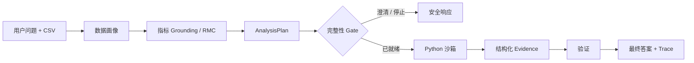

# DataSays

[English](README.md) | [简体中文](README.zh-CN.md)

**面向表格与业务数据的证据优先数据分析 Agent。**

DataSays 将自然语言问题和 CSV 转换为结构化分析计划、沙箱执行的 Python，以及机器可读的结果证据。它不把“代码成功运行”直接视为“分析正确”，而是显式展示指标定义、分析总体、分母、Join、假设与验证结果。

DataSays 当前是用于展示可验证分析工作流的本地作品集原型，不是生产级 ML 平台、全自动数据科学家或完全通用的分析系统。

| 当前能力基线 | 结果 |
|---|---:|
| 能力覆盖 | 13 题 / 4 个 Track |
| 成功执行 | 12 / 13 |
| 审计后数值匹配独立 reference | 12 / 12 个已执行 case |
| 严格 Plan -> Evidence -> Reference E2E | 7 / 13 |

数值审计与严格 E2E 结果被刻意同时展示：数值算对，不等于完整产品合同已经通过。

## 为什么是证据优先分析

两段 Python 都可能成功执行，却在回答不同的业务问题。例如，一种 AOV 计算包含全部已支付订单，另一种只包含已完成订单。如果分子与分母使用了不同总体，代码可以不报错，但结论仍可能误导用户。

```text
代码可执行 != 指标口径正确 != 最终答案可信
```

因此，DataSays 将分析计划、指标定义、总体、分母、粒度、Join、假设、可执行结果与证据视为一个连续合同。

## 工作流程



Resolved Metric Contract（RMC）将可复用指标知识、项目级覆盖规则与真实数据字段绑定，解析为 Planner 使用的唯一有效合同。Fail-closed Gate 会阻止不完整计划进入代码生成。生成的 Python 在受限沙箱中执行，并将 PlannedMetric 与机器可读 Evidence 关联。

工作流使用 LangGraph、FastAPI 和 Pydantic 合同实现，但产品边界是 Evidence-first 分析流程，而不是某个单独框架。

## 分析能力

| 能力 | 状态 | 当前证据 |
|---|---|---|
| 筛选与条件指标 | **已支持** | 严格 E2E capability case |
| 分组对比 | **已支持** | 严格 E2E capability case |
| 排名 / Top-N | **已支持** | 严格 E2E capability case |
| 分布 / 分位数 | **已支持** | 严格 E2E capability case |
| 描述性统计 | **部分支持** | 计算正确，存在一项输出类型缺口 |
| 置信区间、Welch 检验、效应量、相关分析 | **实验性 / 计算可行** | 计算正确，Evidence 覆盖不完整 |
| Logistic Regression、Random Forest、Linear Regression | **实验性 / 计算可行** | 固定数据、split 与 reference 的 probes |
| Cohort / Retention | **部分支持** | 复现 reference 数值，event semantics 仍有限 |
| Funnel 分析 | **尚未证明** | 当前计划在执行前被完整性 Gate 阻止 |

“实验性”表示固定 probe 已执行并匹配独立 reference，不表示 DataSays 已具备生产级统计或预测建模工作流。

## 可靠性机制

- **Metric grounding：**在代码生成前解析业务指标身份、公式、字段绑定和项目规则。
- **Population and denominator：**将共享基础总体与指标特定的分子、分母和筛选规则分离。
- **Grain and joins：**记录实体粒度、Join 关系与必要的预聚合，降低重复和 Join inflation 风险。
- **Plan normalization：**确定性修复序列化差异，不自动猜测业务含义。
- **Fail-closed Gate：**当分析合同不完整时，重新规划、请求澄清或安全停止。
- **Structured Evidence：**将每个 PlannedMetric 映射到标量或数据集 Evidence，不依赖自然语言摘要验证结果。

## 评测

DataSays 使用两套相互独立的 Benchmark。它们测量不同性质，不合并计算单一总准确率。

### Analysis Capability Benchmark V1

这套 13 题评测覆盖 Core、Statistical、Predictive 和 Behavioral 分析广度。Expected values 使用独立、确定性的 Python reference，并固定数据和随机种子。

| 系统质量指标 | 结果 |
|---|---:|
| Canonical AnalysisPlan | 13 / 13 |
| Gate Ready | 12 / 13 |
| 成功执行 | 12 / 13 |
| 有效 AnalysisResult | 12 / 13 |
| 严格机器可读 reference | 9 / 13 |
| Evidence 完整 | 8 / 13 |
| 审计后严格 E2E | 7 / 13 |

12 个已执行 case 的核心数值都匹配独立 reference。更低的严格指标保留了结果表示、Evidence 覆盖和行为语义上的产品缺口，而不是用执行成功隐藏它们。

参见 [题目定义](server/evals/capability_probe_cases.json)、[确定性 references](server/evals/capability_probe_references.json) 和 [capability runner](server/evals/run_capability_probes.py)。

### Business Analytics Reliability Benchmark

Olist-24 是一套严格的可靠性压力测试，覆盖指标语义、population、分子与分母规则、实体粒度、多表 Join、预聚合、业务事件时间、澄清和结构化证据。

当前 post-RMC strict baseline 为 **3 / 24**。这个数字刻意不被表述为 DataSays 整体分析准确率：评测保留了困难失败题，用于诊断可靠性层、Benchmark 假设和结果表示缺口。它不与 Analysis Capability Benchmark 合并计分。

参见 [评测指南](server/evals/README.md)、[Benchmark 设计](server/evals/BENCHMARK_DESIGN.md) 和 [evaluation-driven reliability 技术复盘](docs/evaluation-driven-reliability-improvement.md)。

## 工作流示例

**用户问题**

> 分析 2017 年已交付订单量、Payment GMV、AOV、Delivery Rate 及其月度趋势。

**解析后的计划**

- 使用购买事件作为报告时间。
- 支付记录先聚合到 `order_id` 再 Join。
- Payment GMV 和 AOV 使用已交付订单总体。
- Delivery Rate 保留全部符合条件的订单作为分母。
- 订单表作为保留分母的左侧总体。

**Evidence 支撑的结果**

| Planned fact | 结果 |
|---|---:|
| Delivered Orders | 14,429 |
| Payment GMV | 2,320,454.39 |
| AOV | 160.82 |
| Delivery Rate | 96.19% |
| 月度趋势 | 结构化数据集 |

关键输出不只是四个数值，而是从问题到指标合同、计划、Python 计算、Evidence 和验证的可追踪路径。

## 当前限制

- Statistical Evidence 尚未完全结构化，即使底层计算已经正确。
- Funnel 分析尚未形成稳定可执行合同。
- Cohort 和 Retention 的 event semantics 仍有限。
- Predictive tasks 只是实验性 probes，不代表生产级 ML 支持。
- 当前主要输入为 CSV；Excel、SQL、PDF 和图像抽取不是当前产品能力。
- Validator 检查执行与显式合同，但不能独立证明每一个业务解读在语义上绝对正确。
- DataSays 是本地单用户原型，不是生产级多租户服务。

## 评测驱动开发

```text
Benchmark
-> 定位第一失败层
-> 实施最小确定性修改
-> 增加回归测试
-> 只重跑受影响的 cases
-> 冻结新基线
```

这一过程会区分 retrieval、planning、readiness、code execution、result contract、evidence、semantic correctness 和 scorer behavior。项目保留压力测试中的失败题，而不是放宽 expected answer 来提高表面分数。

## 本地运行

### 前置条件

- Node.js 18+
- Python 3.11+
- 推荐使用 Docker Desktop 运行沙箱
- [OpenRouter](https://openrouter.ai/) API Key

### 配置并启动

```bash
cp server/env.example server/.env
```

在 `server/.env` 中设置 `OPENROUTER_API_KEY`，然后首次构建沙箱镜像：

```bash
docker build -t datasays-python-sandbox -f server/Dockerfile.python-sandbox server
```

在两个终端分别启动后端和前端：

```bash
./start-backend.sh
./start-frontend.sh
```

打开 `http://127.0.0.1:5173`。API 文档位于 `http://127.0.0.1:8000/docs`。

开发时可在 `server/.env` 中设置 `USE_DOCKER=false`，但这会在宿主机直接执行生成的 Python，不能用于公开部署。

### Docker Compose

```bash
export OPENROUTER_API_KEY="your-key"
docker compose up --build
```

打开 `http://localhost:8080`。命名数据卷会保留上传文件与对话数据。

### 开发检查与评测

```bash
npm ci
npm run build

cd server
python -m unittest discover -s tests -v
python evals/run_capability_probes.py
```

评测 runner 会调用已配置模型，可能产生延迟与 API 费用。评测结果 artifact 仅保留在本地，已排除在 Git 之外。

## 数据、持久化与隐私

- 对话与分析运行默认保存在本地 SQLite。
- LangGraph checkpoint 使用单独的本地 SQLite 数据库。
- 上传的 CSV 与 metadata 保存在本地 uploads 目录。
- 刷新页面后可恢复已持久化的消息、Evidence、代码、Trace、文件关联与 Dashboard artifact。
- 数据画像、样例、Prompt 或生成产物可能被发送到所选 OpenRouter 模型；本地部署不等于完全离线处理。
- 环境文件、上传文件、数据库、checkpoint 和评测 artifact 已排除在 Git 之外。

详见 [持久化与记忆](docs/PERSISTENCE_AND_MEMORY.md) 和 [可视化合同](docs/VISUALIZATION_CONTRACT.md)。

## Roadmap

1. 补齐 Statistical Analysis 的机器可读 Evidence。
2. 在 Funnel 或 Cohort 中选择一个行为分析工作流稳定化。
3. 在不放宽确定性 reference 和可靠性要求的前提下扩展 capability evaluation。

## 仓库结构

```text
datasays/
├── App.tsx                     # React 分析工作区
├── components/                 # 分析、证据、对比与 Dashboard UI
├── lib/                        # API client、共享类型、i18n 与格式化
├── server/
│   ├── main.py                 # FastAPI 入口
│   ├── app/                    # Agent route、合同与 service
│   ├── app/knowledge/          # Skills、指标定义与项目覆盖规则
│   ├── evals/                  # Capability 与 Reliability Benchmark
│   └── tests/                  # 确定性回归测试
├── docs/                       # 产品合同与技术复盘
└── docker-compose.yml          # 本地自托管编排
```

## 许可

该仓库最初来自 ISE547 课程项目，当前尚未授予独立的开源软件许可。Olist Benchmark 数据的来源与许可信息单独记录在 [评测数据文档](server/evals/data/olist/README.md) 中。
