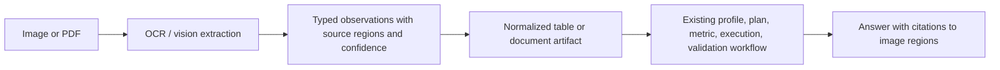

# DataSays 2.0

## Product Positioning

DataSays is a metric-aware, evidence-first data analysis agent. Its purpose is not to support every possible data source or tool. It focuses on whether an answer follows an explicit business definition, can be reproduced from an execution artifact, and can be inspected when it fails.

## Current P0 Workflow

1. Profile each uploaded CSV: types, semantic roles, missingness, cardinality, samples, ranges, and duplicate rate.
2. Select a small analysis playbook from local versioned knowledge.
3. Retrieve matching ecommerce or SaaS metric definitions and bind logical concepts to actual columns.
4. Generate a typed `AnalysisPlan`.
5. Generate Python that emits a typed `AnalysisResult` marker.
6. Execute in the existing sandbox.
7. Validate execution, required columns, metric grounding, result structure, and final-answer numeric faithfulness.
8. Retry code generation with validation feedback within a bounded repair loop.
9. Show the plan, definitions, artifact, checks, assumptions, and workflow trace in the UI.

## Scope Boundary

| Area | Current P0 | Later P1/P2 |
|---|---|---|
| Orchestration | Bounded typed service workflow | LangGraph persistence, checkpoints, streaming events |
| Knowledge | Versioned JSON metric packs and deterministic retrieval | Embedding retrieval for larger knowledge collections |
| Evaluation | 24-case executable benchmark plus service tests | Version comparisons, human review, LLM judge, LangSmith |
| Data sources | CSV | Excel, SQL, dashboard images, PDFs |
| Agents | One bounded analysis agent | No multi-agent system unless a real coordination need appears |

## Resume-Safe Claims

The repository currently demonstrates planning, local Skill selection, metric retrieval, tool-like service calls, sandbox execution, validation, bounded repair, trace metadata, and persisted analysis artifacts. It does not yet implement LangGraph, durable graph checkpoints, real-time SSE events, semantic conversation memory, vector retrieval, MCP, or production SaaS isolation. Those capabilities should only be claimed after their acceptance criteria are implemented and tested.

## Multimodal Roadmap

Images should enter through an extraction layer instead of being treated as CSVs.

The recommended first image scope is dashboard screenshots and photographed tables. They can be normalized into rows and columns, then reuse most of the current workflow. General photos require a different validation contract: detected objects and attributes, bounding regions, model confidence, and explicit uncertainty.

## Ownership

Engineering work such as orchestration, schemas, sandbox protocol, validation, UI evidence, tests, and documentation can be implemented independently. The user or a domain owner must approve business truth: metric formulas, inclusion and exclusion rules, time windows, representative datasets, and expected benchmark answers.
