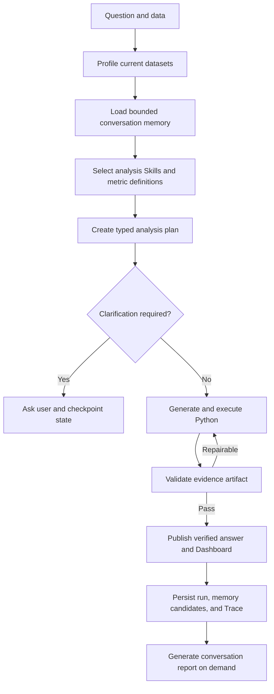

# DataSays Verified Business Analysis Agent PRD

## 1. Product Goal

DataSays helps operations and business users turn exported data into reproducible conclusions without writing Python. Every published answer must expose its calculation plan, data fields, business definitions, executable artifact, validation result, assumptions, and limitations.

The product is a bounded analysis Agent, not a general autonomous employee and not an MLOps platform.

## 2. Target Users And Jobs

| User | Job to be done | Current entry point |
|---|---|---|
| Operations analyst | Diagnose a metric change and identify segments requiring action | Upload CSV and ask a question |
| Product or business manager | Validate a decision with traceable evidence | Verified Analysis and Dashboard |
| Agent developer | Compare model and prompt behavior and inspect failure paths | Comparison Lab and workflow Trace |

## 3. Product Principles

1. Evidence before fluency: execution and validation precede final wording.
2. Bounded autonomy: every loop has an explicit stop condition.
3. Trusted memory only: failed or low-confidence runs remain auditable but never become factual memory.
4. Dataset scope first: prior findings cannot cross into unrelated uploaded files.
5. Progressive disclosure: business conclusions are primary; code, checks, and Trace remain inspectable.

## 4. Target Workflow

## 5. Milestones And Status

| Milestone | Acceptance criteria | Status |
|---|---|---|
| P0 Typed analysis core | Profile, plan, deterministic missing-evidence guard, code execution, typed result, validation and bounded repair | Complete |
| P0 Evidence UI | One verified answer, checks, assumptions, code, Trace, structured Dashboard | Complete |
| P0 Persistence | Conversations, messages, files, runs and artifacts survive refresh/restart | Complete |
| P1 Bounded conversation memory | Recent turns and validated findings inform follow-ups; current message, failed runs and unrelated datasets are excluded | Complete |
| P1 Graph orchestration | LangGraph state, explicit nodes, conditional edges and durable checkpoints | Complete |
| P1 Live progress | Backend emits node events; frontend renders actual state instead of a simulated timer | Complete |
| P1 Conversation report | Generate an HTML/Markdown report from successful run IDs with citations and reusable charts | Not started |
| P1 Evaluation upgrade | Separate calculation correctness from end-to-end business-analysis capability; compare versions and failure categories | Implemented: Olist v1 calculation suite; Olist v2.1.0 24-case capability suite, full Qwen3.6 Flash baseline (4/24), per-case failure analysis, clarification and memory diagnostics. The older v1 23/24 report used the pre-sampling fixture and must be rerun for v1.1.0. |
| P2 Business data access | Read-only SQL/API connectors, credentials isolation and query audit | Not started |
| P2 Production deployment | Authentication, tenancy, object storage, Postgres, job queue, quotas and hardened workers | Not started |

## 6. P1 Memory Contract

The context packet contains at most eight recent messages and five validated findings. A finding is eligible only when:

- the analysis run status is successful;
- deterministic artifact validation passed;
- the run identifies at least one dataset also used by the current request.

The current user message is excluded because it is already supplied as the active question. Prior numeric findings are context only: requested values must be recomputed from current files. Memory metadata exposes counts and source run IDs in the workflow Trace without exposing the full prompt packet.

## 7. Non-Goals For The Current MVP

- Multi-agent collaboration;
- autonomous model deployment or MLOps;
- unrestricted shell, network, or filesystem access;
- silent automatic data cleaning;
- long-term preference learning or self-modifying prompts;
- scheduled business monitoring and outbound alerts.

## 8. Success Metrics

| Dimension | Metric |
|---|---|
| Correctness | v1 numeric accuracy; v2 structured fact recall and metric-definition adherence |
| Reliability | Sandbox success, typed-result coverage and repair success rate |
| Trust | Unsupported-number rate and validation pass rate |
| Analysis quality | Business-term coverage, clarification accuracy and evidence-backed recommendation review |
| Follow-up quality | Reference-resolution and memory-use accuracy without cross-dataset leakage |
| Efficiency | End-to-end latency and model token usage |
| Product value | Verified analyses completed and reports exported per active user |

## 9. Resume-Safe Description

DataSays currently demonstrates a single bounded LangGraph Agent with structured planning, deterministic clarification for missing metric evidence or requested dimensions, local Skill selection, metric grounding, dataset-scoped conversation memory, sandbox tool execution, deterministic validation, conditional repair, SQLite node checkpoints, live SSE progress, evidence Trace, interactive visualization, and local persistence. MCP, vector RAG, checkpoint resume/approval APIs, report generation, and production SaaS isolation remain future work until their acceptance criteria are implemented.

## 10. Implemented Graph Contract

The current graph contains explicit `profile_data`, `load_memory`, `select_skills`, `retrieve_metrics`, `plan_analysis`, `generate_code`, `execute_code`, `validate_result`, `repair_code`, and `finalize_response` nodes. Clarification and visualization-policy repair are separate branches. Validation can route to finalization, a bounded repair loop, or a non-repairable failure.

Each analysis uses a unique `graph_thread_id` and persists node snapshots in `agent-checkpoints.db`. The browser consumes public workflow summaries over `POST /api/query/stream`; these summaries describe selected tools, plans, outcomes, and repair reasons without exposing private model chain-of-thought. Resume, approval, replay, and checkpoint administration remain outside the current UI and API.
