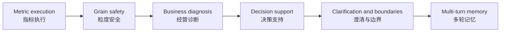

# Olist Business Analysis Suite v2: Design Note / 设计说明

## 1. Evaluation Question / 评测问题

The suite asks whether DataSays can turn realistic multi-table ecommerce data into a useful, reproducible business analysis. A capable run should compute the right evidence, explain the business meaning, recognize missing information, preserve statistical boundaries, and continue a follow-up conversation safely.

该题集评估 DataSays 能否把真实多表电商数据转化为有用、可复现的经营分析。一次合格运行不仅要算对，还要解释业务意义、识别信息缺口、保持统计边界，并能安全地承接追问。

It intentionally does not ask whether the model can produce the most elegant prose, discover every possible insight, or match an unconstrained human analyst. Those goals require human review and a broader dataset portfolio.

它不评估文案是否最漂亮、是否发现所有可能洞察，也不宣称可替代不受约束的人类分析师。这些目标需要人工评审和更广泛的数据集。

## 2. Why Two Suites / 为什么保留两套题

The v1 Calculation Suite isolates arithmetic and data-manipulation regressions. Its scalar answers are easy to compare across model or prompt versions. The v2 Business Analysis Suite introduces multi-fact requests, ambiguity, recommendations, quality audits, and follow-ups. Combining them would hide whether a failure came from calculation or analysis behavior.

v1 计算题集用于隔离算术和数据处理回归，标量答案便于比较模型与 Prompt 版本。v2 加入多事实需求、歧义、建议、质量审计和追问。若强行合并，一个总分无法说明失败来自计算还是分析行为。

## 3. Case Design Logic / 题目设计逻辑

Each v2 case starts from a plausible user decision rather than a Pandas operation. The case then declares:

每道 v2 题先定义一个可信的用户决策，而不是先定义 Pandas 操作。随后声明：

- `user_need`: why the user asks / 用户为什么问；
- `capability`: the Agent behavior under test / 要测试的 Agent 行为；
- `datasets`: tables required to answer / 所需数据表；
- `facts`: deterministic values or entities / 确定性数值或实体；
- `required_term_groups`: business meaning and caveats / 业务意义和限制；
- optional expectations for metric IDs, plan intent, visualization, clarification, and memory / 可选的指标、计划、图表、澄清与记忆预期。

The six dimensions form a progression:

The progression moves from correct computation to trustworthy product behavior. It is not a claim that later dimensions are always harder for every model.

该结构从正确计算逐步走向可信产品行为，但不表示后面的维度对所有模型都必然更难。

## 4. Fixture Sampling / 评测数据抽样

The committed fixtures contain a deterministic customer-level sample targeting 15,000 orders from the 2017 source. Customers are ranked by a stable SHA-256 hash of `customer_unique_id`; every order for a selected customer is retained. Order items, payments, and reviews are then filtered by `order_id`, and products by `product_id`. This prevents broken joins and preserves repeat-order, multi-item, multi-payment, and duplicate-review behavior.

仓库内 fixture 是从 2017 年原始数据中生成的客户级确定性抽样，目标为 15,000 笔订单。脚本按 `customer_unique_id` 的 SHA-256 结果稳定排序，保留入选客户的所有订单；随后用 `order_id` 筛选明细、支付和评价，用 `product_id` 筛选商品。这样不会破坏 Join，也能保留复购、多商品、多次支付和重复评价等行为。

The 15,000-order size keeps six states and twelve product categories above the suite's 500-order diagnostic threshold, plus sixty-two sellers above the 50-order threshold. It reduces fixture storage and sandbox work by roughly two thirds compared with the earlier 45,101-order fixture. Expected values are regenerated after sampling; scores from the old fixture are not directly comparable.

15,000 订单下仍有 6 个州和 12 个品类超过 500 单诊断门槛，并有 62 个卖家超过 50 单门槛。相较之前 45,101 订单的 fixture，仓库体积和沙箱计算量约降低三分之二。抽样后会重新生成标准答案，旧数据上的分数不可直接比较。

The complete 24-case table-to-question map is maintained in [`README.md`](README.md#v2-case-to-data-map--v2-题目与数据表映射).

24 题对应数据表的完整映射见 [`README.md`](README.md#v2-case-to-data-map--v2-题目与数据表映射)。

## 5. Deterministic Reference / 确定性标准答案

[`olist_business_reference.py`](olist_business_reference.py) calculates reusable facts directly with Pandas from the committed fixtures. [`prepare_olist_business_benchmark.py`](prepare_olist_business_benchmark.py) inserts those facts into the versioned JSON case file. Float values are rounded during generation to avoid process-level last-bit differences.

[`olist_business_reference.py`](olist_business_reference.py) 使用 Pandas 从仓库内精简表直接计算标准事实；[`prepare_olist_business_benchmark.py`](prepare_olist_business_benchmark.py) 将事实写入版本化 JSON。生成时统一浮点精度，避免不同进程的末位抖动。

Reference choices are explicit and inspectable. Examples include payment-defined GMV, item-price category revenue, order-level review aggregation, `customer_unique_id` for repeat customers, and aggregation before joining payment and item fact tables.

关键口径都可检查，例如支付口径 GMV、商品 `price` 品类收入、订单级评价聚合、使用 `customer_unique_id` 识别复购，以及支付与商品事实表先聚合再关联。

## 6. Scoring Contract / 评分协议

The scorer separates hard gates from supporting diagnostics.

评分器区分硬性通过条件与辅助诊断指标。

**Hard gates / 硬性条件**

1. The Agent returns a successful workflow status.
2. A non-clarification task returns a structured `AnalysisResult`; a clarification task stops without one.
3. Structured facts meet the case recall threshold and numeric tolerance.
4. Required business-term groups meet the coverage threshold.
5. Clarification behavior matches the expected branch.
6. A follow-up marked as memory-dependent reports `metadata.memory.used = true`.

**Supporting diagnostics / 辅助指标**

- metric-definition IDs selected by the plan;
- plan intent classification;
- requested chart type coverage;
- deterministic Validator result;
- repair count and latency.

These diagnostics remain visible without hard-failing a case because a correct analysis may use a different valid intent or chart. They can be promoted to hard gates after baseline evidence shows the expectation is stable.

这些指标暂不作为硬门槛，因为正确分析可能使用不同但合理的计划类型或图表。只有在基线证明预期稳定后，才适合升级为硬门槛。

## 7. Multi-turn Protocol / 多轮协议

Multi-turn cases use a real persisted conversation. The first answer is saved through `/api/query`; the second query uses the same `conversationId`. DataSays builds context from recent messages and successful, validated findings scoped to the current files. The second turn must still recompute requested values from current data.

多轮题使用真实持久化会话：第一轮通过 `/api/query` 保存，第二轮复用同一 `conversationId`。DataSays 只加载近期消息以及当前文件范围内成功且验证通过的结论；第二轮仍需从当前数据重新计算。

The current score confirms that memory was loaded and that the answer facts are correct. It does not yet isolate whether each fact came causally from memory rather than another inference path. A future ablation should compare the same follow-up with memory enabled and disabled.

当前评分能确认记忆已加载且答案事实正确，但不能严格证明每个事实都因记忆而得到。后续应加入同一追问在开启和关闭记忆时的消融对比。

## 8. Relationship To DataSciBench / 与 DataSciBench 的关系

[DataSciBench](https://github.com/THUDM/DataSciBench) evaluates broad data-science agents with task-specific test cases and aggregate functions. DataSays borrows the principle that outputs should satisfy executable or explicit checks. It does not import the official task corpus because DataSays currently has a narrower CSV business-analysis product contract and a different structured output schema.

[DataSciBench](https://github.com/THUDM/DataSciBench) 使用任务级测试和聚合函数评估通用数据科学 Agent。DataSays 借鉴“输出必须满足可执行或明确测试”的原则，但没有导入其官方题库，因为当前产品聚焦 CSV 经营分析，结构化输出协议也不同。

Potential future use is a separate compatibility track: select tasks whose files fit the sandbox, add an artifact adapter, and report DataSciBench-compatible results separately from Olist business scores.

未来可建立独立兼容轨道：筛选适合当前沙箱的任务、增加产物适配器，并将 DataSciBench 兼容结果与 Olist 经营分析分数分开报告。

## 9. Known Limitations / 已知限制

- Olist is one ecommerce domain and one historical market snapshot.
- Recommendation scoring uses explicit required concepts, not expert ranking of action quality.
- The benchmark does not yet test SQL sources, spreadsheets, images, causal experiments, forecasting, or model deployment.
- Clarification accuracy currently has only two strict stop cases plus one causal-boundary case.
- One complete Qwen3.6 Flash baseline is recorded for v2.1.0; more models and repeated runs are still needed.
- The v2.1.0 authored `0.67` term threshold is slightly stricter than exact two-of-three coverage; the recorded result is preserved and a future version should use exact fractional thresholds.
- Complete token and API-cost accounting is not yet included in the runner output.

- Olist 只代表一个电商领域和一个历史市场切片；
- 建议评分检查必要概念，不是专家对行动质量的完整排序；
- 当前未测试 SQL、Excel、图片、因果实验、预测或模型部署；
- 澄清能力目前只有两个严格停止题和一个因果边界题；
- v2.1.0 已记录一次完整 Qwen3.6 Flash 基线，仍需补充其他模型和重复运行。
- v2.1.0 的 `0.67` 要点阈值略严于精确的三分之二；已记录结果保持不变，后续版本应使用精确分数。
- Runner 尚未完整汇总 Token 和 API 成本。

## 10. Review Checklist / 人工复核清单

Before publishing a baseline, inspect failed and passed samples for: correct grain, explicit denominators, date scope, unsupported causal language, actionable recommendations, chart usefulness, and accidental scoring matches. Record the model ID, prompt style, date, code revision, and raw JSON report.

发布基线前，应抽查通过和失败样本：数据粒度、分母、时间范围、因果越界、建议可执行性、图表价值以及评分误命中；同时记录模型 ID、Prompt 类型、日期、代码版本和原始 JSON。
